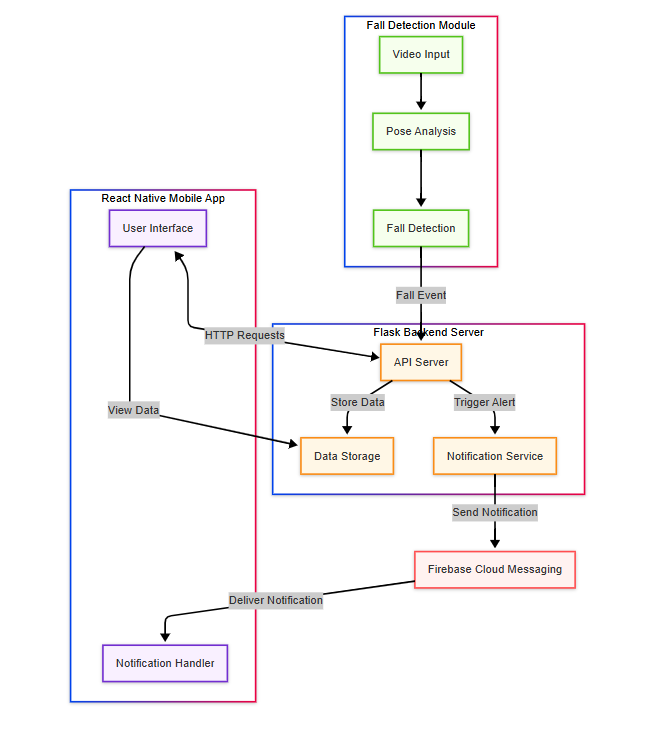

# Fall Detection System

## Overview

The Fall Detection System is an integrated solution that uses computer vision to detect falls in real-time, send alerts through a Flask API, and display notifications on a React Native mobile app. The system is designed to monitor elderly or vulnerable individuals and provide immediate notifications when a fall is detected.


## Demo

Below is a demonstration of the fall detection system in action:


## Features

- **Real-time Fall Detection**: Uses OpenCV and MediaPipe for pose detection and fall analysis
- **Configurable Sensitivity**: Adjustable thresholds for fall detection sensitivity
- **Snapshot Capture**: Automatically captures images when falls are detected
- **Event Logging**: Comprehensive logging of all detection events
- **Mobile Notifications**: Real-time alerts sent to mobile devices
- **Web API**: RESTful API for system integration
- **WebSocket Support**: Real-time status updates via WebSockets
- **Mobile App**: Cross-platform React Native mobile application

## System Architecture

The system consists of three main components:

1. **Fall Detection Module**: Core Python module using OpenCV and MediaPipe for pose detection and fall analysis
2. **Flask Backend Server**: API server that processes detection events and sends notifications
3. **React Native Mobile App**: Mobile interface for receiving alerts and viewing detection events

### System Flowchart

The following flowchart illustrates the complete process flow of the fall detection system:



## Requirements

### Server Requirements

- Python 3.8+
- OpenCV
- MediaPipe
- Flask
- Other dependencies listed in `requirements.txt`

### Mobile App Requirements

- Node.js 14+
- React Native 0.65+
- Firebase account for push notifications

## Installation

### 1. Clone the Repository

```bash
git clone https://github.com/yourusername/fall-detection-system.git
cd fall-detection-system
```

### 2. Set Up Python Environment

```bash
# Create a virtual environment
python -m venv venv

# Activate the virtual environment
# On Windows
venv\Scripts\activate
# On macOS/Linux
# source venv/bin/activate

# Install dependencies
pip install -r requirements.txt
```

### 3. Configure the Server

1. Navigate to the server directory:
   ```bash
   cd server
   ```

2. Create a `.env` file based on the example:
   ```bash
   cp .env.example .env
   ```

3. Edit the `.env` file with your configuration settings

### 4. Set Up the Mobile App

1. Navigate to the mobile app directory:
   ```bash
   cd mobile_app
   ```

2. Install dependencies:
   ```bash
   npm install
   ```

3. Configure Firebase for push notifications

## Usage

### Running the Fall Detection Server

```bash
cd server
python app.py
```

The server will start on http://localhost:5000 by default.

### Testing the API

You can test the API endpoints using tools like Postman or curl:

```bash
# Get system status
curl http://localhost:5000/api/status

# Register a device for notifications
curl -X POST -H "Content-Type: application/json" -d '{"token":"your-device-token"}' http://localhost:5000/api/register-device
```

### Running the Mobile App

```bash
cd mobile_app
npx react-native start

# In a new terminal
npx react-native run-android
# or
npx react-native run-ios
```

## Configuration

### Fall Detection Parameters

The fall detection algorithm can be tuned by adjusting the following parameters in the server's configuration:

- `fall_threshold`: Controls sensitivity of fall detection (lower = more sensitive)
- `motion_threshold`: Determines lack of movement detection
- `velocity_history_size`: Number of frames to track for velocity calculation
- `immediate_fall_threshold`: Confidence threshold for immediate notification

### Video Input Configuration

The system supports various video input sources:

- Video files: Set `video_source` to a file path
- Webcam: Set `video_source` to `0` (or another camera index)
- IP Camera: Set `video_source` to an RTSP URL

## API Documentation

### Endpoints

- `GET /api/status`: Get current system status
- `POST /api/register-device`: Register mobile device for notifications
- `GET /api/events`: Get fall detection events history
- `GET /api/snapshots/<filename>`: Retrieve fall detection snapshots
- `POST /api/settings`: Update fall detection settings

### WebSocket Events

- `fall_detected`: Real-time fall detection alert
- `status_update`: System status updates

## Deployment

### Server Deployment

For production deployment, it's recommended to use Gunicorn as a WSGI server:

```bash
cd server
gunicorn -b 0.0.0.0:5000 app:app
```

Consider using Docker for containerization:

```bash
docker build -t fall-detection-server .
docker run -p 5000:5000 fall-detection-server
```

### Mobile App Deployment

For Android:
```bash
cd mobile_app
npx react-native build-android
```

For iOS:
```bash
cd mobile_app
npx react-native build-ios
```

## Security Considerations

- Use HTTPS for all API communications
- Implement proper authentication for API endpoints
- Secure storage of API keys and credentials
- Handle user permissions appropriately

## Future Enhancements

- Multiple camera support
- User management system
- Advanced analytics dashboard
- Customizable alert thresholds
- Integration with emergency services

## Contributing

Contributions are welcome! Please feel free to submit a Pull Request.

## License

This project is licensed under the MIT License - see the LICENSE file for details.

## Acknowledgements

- OpenCV for computer vision capabilities
- MediaPipe for pose detection
- Flask for the web server framework
- React Native for the mobile application framework
